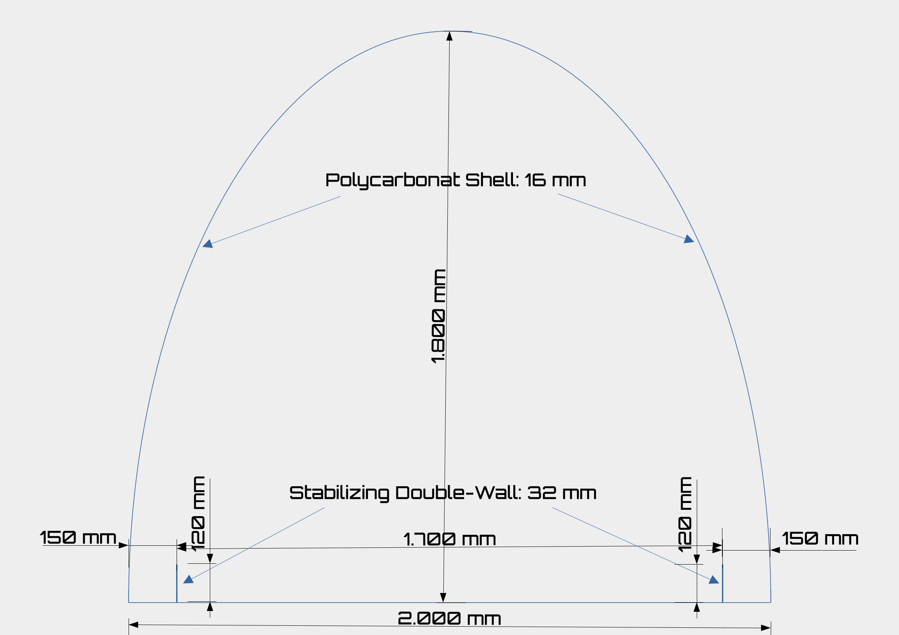

# PROJECT AQUA-NEPTUNE: TECHNICAL SPECIFICATIONS
## Engineering Architecture, Materials, and Fluid-Dynamics Manifesto

---

### 1. SYSTEM DIMENSIONS & ARCHITECTURAL GEOMETRY

The infrastructure is engineered as a **Two-Part Modular System** consisting of a rigid structural ground tray and a flexible, detached catenary roof structure.

_Note: All associated graphics and repository images are to be considered a schematic representation / structural layout visualization only._

* **Total Exterior Width:** 2000 mm (2.0 Meters)
* **Maximum Apex Height:** 1800 mm (1.8 Meters)
  * *Thermodynamic Optimization:* This exact height minimizes the internal air volume to guarantee rapid solar air heating, while maintaining full human ergonomics for maintenance crews.
* **Aqueduct Longitudinal Gradient:** < 0.5% (0.2% - 0.4% target slope). 
  * *Fluid Mechanics:* Fluid movement is driven exclusively by the Earth's gravity, completely eliminating electrical pumping power over long distances.

#### Cross-Section Design (Scale Layout)

  

---

#### Component Deconstruction (Ground Tray Profile)
* **Central Seawater Channel (Middle Tray):** 1700 mm wide, resting completely flat on the desert ground base level. 
  * *Thermodynamic Rule:* Maximizes the surface-area-to-volume ratio of the seawater to exponentially accelerate solar evaporation.
* **Lateral Catchment Channels (Left & Right Channel):** 150 mm wide, 120 mm deep, located completely **inside** the protective outer shell to avoid fluid loss.
  * *Surface Tension Rule:* Pure condensed water slides down the inner curved Polycarbonate roof via surface tension and drops directly into these integrated outer channels.
* **Internal Stabilizing Joint Profile:** 120 mm height, built with a double-wall thickness (32 mm total structural width). This profile acts as a structural fold (**Folder Structure**), multiplying rigidity against lateral liquid force while safely acting as an anti-spill barrier between seawater and fresh distillate.
* **Outer Shell Structural Flanges:** 120 mm height connection walls at the absolute left and right perimeter. These 120 mm walls are geometric-engineered with a slight inward curve (radial relief) to absorb high cyclic thermodynamic expansion and prevent structural material fatigue.
* **Integrated Factory-Pre-Assembled Gasket System:** The inner vertical face of both 120 mm outer flanges comes equipped with a factory-bonded, heavy-duty 120 mm x 6 mm EPDM elastomeric profile gasket. This ensures absolute airtight and watertight sealing immediately upon sliding the roof module into place on site.

---

### 2. MATERIAL & SELECTION SPECIFICATIONS

#### A. The Detached Catenary Roof (Catenary Vault)
* **Material:** Multi-Wall Hollow-Chamber-Polycarbonate (Twin-Wall or Triple-Wall sheets).
* **Wall Thickness:** 10 mm - 16 mm.
  * *Thermal Insulation:* The internal air gaps within the sheet trap thermal energy, ensuring evaporation continues autonomously for several hours after sunset.
* **Surface Coating:** Single-sided co-extruded UV-Protection (Facing Outwards). Preventative engineering against yellowing, structural embrittlement, and optical degradation from harsh desert solar radiation.

#### B. The Structural Ground Tray (Ground Tray Module)
* **Base Structure:** Heavy-duty, solid extruded Food-Grade Polycarbonate sheets.
* **Sealing System:** A 120 mm wide, 5 mm - 6 mm thick heavy-duty elastomeric, non-toxic EPDM profile gasket line lined on the inner side of the outer structural flanges.
* **Fastening System:** The detached roof element is slid into the gasket line and mechanically locked into the inner side of the channel structure utilizing industrial Automotive-Grade plastic expansion rivets, allowing stress-free thermal shifting.
* **Central Channel Thermal Coating (Black):** Coated with a specialized, highly durable, food-grade certified black Epoxy or Polyurethane matrix (FDA compliant / EC 1935/2004). Guarantees maximum solar absorption (low albedo) while completely preventing toxic leaching into the NaCl salt harvest.
* **Lateral Catchment Coating (Reflective):** The inner surfaces of the fresh H²O channels are coated with an ultra-pure, food-grade Titanium Dioxide ($TiO_2$) reflective white shield or medical-grade mirror-polished liners. This reflects incoming solar rays to keep the harvested freshwater cool and completely prevent heat-induced re-evaporation.

---

### 3. THE THERMODYNAMIC SEPARATION CURTAIN

At the precise length where fractional evaporation finishes, a **Thermodynamic Curtain** seals off the channel.

* **Function:** It creates a complete air-mass barrier between the high-humidity evaporation zone and the bone-dry post-processing crystallization zone.
* **Result:** It prevents water vapor from re-humidifying the precipitated salt.

---

### 4. THE JET-BLACK CONVEYOR HARVESTER

* **The Anti-Albedo Problem:** Left static, crystalline salt creates a mirror effect (high albedo), reflecting solar rays and destroying the thermal efficiency of the greenhouse floor.
* **The Solution:** A mechanical, continuous, ultra-slow conveyor belt running exclusively behind the thermodynamic curtain.
* **Color:** Jet-Black (Maximum Solar Absorption).
* **Speed Profile:** Operates at a micro-velocity (snail's pace) entirely inside the dry greenhouse zone until the **Pure NaCl (Salt)** is completely bone-dry for non-abrasive packaging into sacks or containers.

---

### 5. VEHICLE POWERTRAIN INTEGRATION

The green hydrogen produced from the distilled water feeds a decentralized, closed-loop automotive network:

* **Engine Configuration:** Hydrogen Internal Combustion Engine (H2-ICE) serving exclusively as a **Serial Hybrid Generator**.
* **Operational Mode:** Fixed RPM (Thermodynamic Sweet Spot, e.g., locked at 2500 RPM).
* **Efficiency Yield:** Eliminates throttle losses and transitional acceleration spikes, yielding a steady thermal efficiency of 45% - 50%.
* **Buffer System:** Energy is pushed into a small, lightweight buffer battery. Heavy, resource-destructive 100 kWh chemical batteries are completely engineered out of the vehicle.
* **Exhaust Condensation Catchment:** The vehicle tailpipe is equipped with an integrated condensation heat-exchanger. Pure H²O exhaust emissions are liquefied, retained in an onboard tank, and deposited back at refueling stations.

---

### 6. TOTAL PROJECT COMMODITY OUTPUTS

Project AQUA-NEPTUNE does not operate on artificial market scarcity. It continuously yields:

1. **Green Hydrogen (H²):** 120 MJ/kg high-density energy stock.
2. **Pure Distilled & Drinking Water (H²O):** For human life and agricultural desert terraforming.
3. **Food-Grade & Industrial Salt (NaCl):** Clean crystalline commodities.
4. **Strategic Residual Minerals:** Precipitated extraction of Lithium, Magnesium, and Calcium.
5. **Medical Oxygen (O²):** High-purity electrolysis byproduct.
6. **Baseload Solar Electricity:** Direct surplus solar PV generation routed into regional local grids.

---

### 7. RE-SPLITTING MATRIX (THE TRANSNATIONAL ENERGY LOOP)
The clean water returned by vehicle drivers at destination countries is subjected to **Secondary Electrolysis** utilizing regional daytime Solar PV and Wind grids. This locks the energy into a secondary local cycle, transforming the water into an eternal transnational energy carrier.

---

### 8. INTELLECTUAL PROPERTY & GLOBAL LICENSE STATUS
This file and all associated schematics are free from corporate patent-hoarding. It is a gift to a resource-parched planet.

* **License:** Creative Commons Attribution-NonCommercial 4.0 International (**CC BY-NC 4.0**).
* **Commercial Restrictions:** No entity may sell, monetize, or lock this technology behind private financial paywalls or private corporate patents.
* **Attribution:** Mention-Obligation is legally mandatory. The name of the original author must remain permanently attached to all implementations, structural simulations, and derivatives.

---

**DOCUMENT METADATA & LEGAL CREDENTIALS**

* **Document Version:** 1.0
* **Released:** August 2026
* **Author:** Toni Avantaggiato
* **Contact:** tony.advantaged@gmail.com / +49 152 29 564 323
* **Location:** Munich, Germany

_Official License Notice: This framework is licensed under the Creative Commons Attribution-NonCommercial 4.0 International License. To view a copy of this license, visit http://creativecommons.org or send a physical letter to Creative Commons, PO Box 1866, Mountain View, CA 94042, USA._

---
